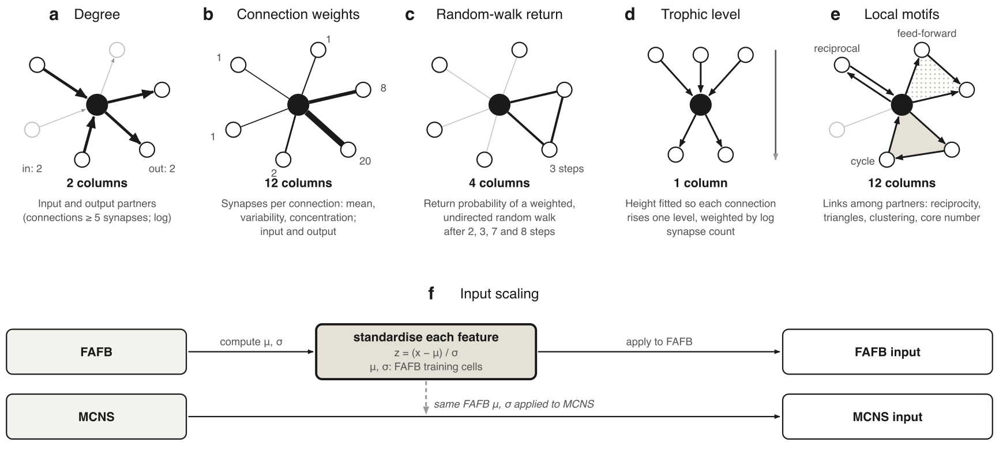
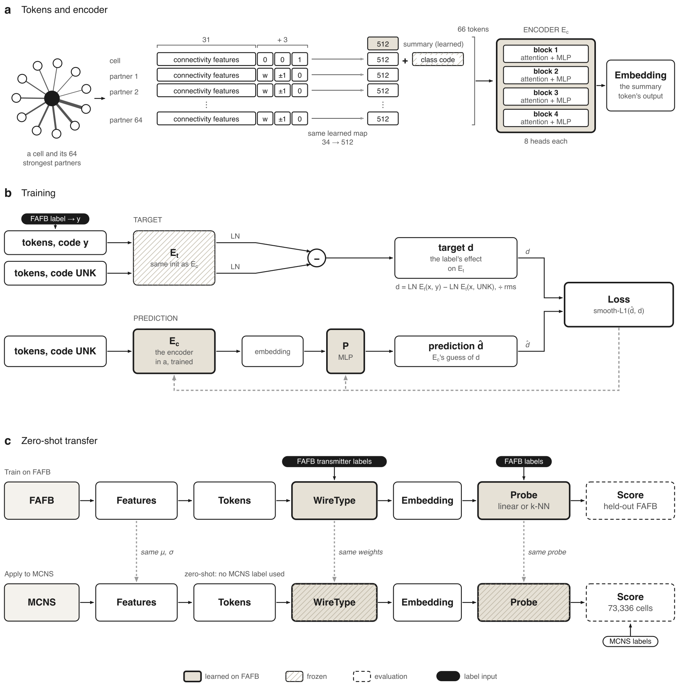

# WireType

Code for *Wiring identifies neurons across* Drosophila *connectomes, allowing
neurotransmitter prediction* (Wilson, 2026; preprint: [TBD]).

The pipeline computes connectivity features for every neuron of a connectome, trains
WireType, a transformer encoder, on one volume's transmitter labels, applies the frozen
encoder to a second volume, and fits and scores probes on its embeddings. It reads the
FlyWire v783 release of the female adult fly brain (FAFB) and the v1.0 release of the
male central nervous system (MCNS), and runs in either direction.

## Model



**Connectivity features.** Each neuron is described by 31 numbers in five families:
degree (a), connection weights (b), random-walk return (c), trophic level (d) and local
motifs (e). Every feature is standardised with the mean and standard deviation of the
source volume's training neurons, and the same values are applied to the target (f).
`src/wiretype/data/features.py` computes degree and connection weights, loads the other
families (precomputed by `scripts/rwse.py`, `scripts/flow.py` and `scripts/local.py`),
selects the 31 columns listed in `src/wiretype/data/column_sets/refined.json` and
standardises them. Supplementary file 1 (`docs/supplementary/`, written by
`scripts/supplementary_file_1.py`) defines all 47 candidate features.



**Encoder, training and transfer.** (a) A neuron and its 64 strongest partners give 65
tokens (`scripts/topk.py`, `src/wiretype/model/tokens.py`). Four attention blocks read
them together with a learned summary token, whose output is the neuron's embedding
(`CellEncoder` in `src/wiretype/model/encoder.py`). (b) `scripts/train.py` trains the
encoder to predict, from the neuron without its label, how a frozen copy's output
changes when the transmitter label is added (the target is `displacement` in
`tokens.py`; the predictor is `Predictor` in `encoder.py`). (c) `scripts/transfer.py`
applies the frozen encoder to the target with the source's feature scaling, and probes
fitted on the source (`src/wiretype/eval/transfer.py`).

## Repository layout

| path | contents |
|---|---|
| `src/wiretype/` | the package: `data/` (intake, labels, features, splits, scope), `model/` (encoder, tokens), `eval/` (probes, transfer, release) |
| `scripts/` | one entry point per pipeline stage |
| `scripts/diagnostics/` | analyses of saved predictions and embeddings |
| `hpc/` | Grid Engine job scripts (`hpc/jobs/`), the submission script for the paper's runs, environment setup |
| `envs/` | lock files of the environments used (`envs/README.md`) |
| `tests/` | `check_release.py`, run before the release tables are built |
| `docs/` | Supplementary file 1 and the images above |
| `data/raw/`, `data/processed/` | the input releases and the pipeline's intermediate tables (not tracked) |
| `experiments/` | outputs: checkpoints, reports, predictions and embeddings (not tracked) |
| `logs/` | job logs (not tracked) |

## Installation

**Local** (diagnostics, label audit, release tables; no torch):

```bash
uv venv --python 3.11 .venv && uv pip install --python .venv/bin/python -r envs/local.txt
```

Local scripts run the package from `src/`, as `PYTHONPATH=src .venv/bin/python <script>`.
Training, transfer and the baselines need a CUDA GPU; `pip install -e .` installs the
package with torch and torch-geometric.

**HPC (Grid Engine).** `hpc/` is a template for a Grid Engine (SGE) cluster and will
likely need modifying for yours: the paths and module names in `hpc/config.sh`, and the
resource requests (queue, GPU, memory, run time) in the header of each script in
`hpc/jobs/`. Jobs run from the repo root.

```bash
source hpc/config.sh
bash hpc/setup.sh all      # the analysis environment (feature jobs) and the CUDA torch environment
bash hpc/setup.sh check    # imports, the input data, and every analysis script's --help
```

If the compute nodes have no internet access, download the data elsewhere and copy it
to `WIRETYPE_DATA`.

## Data

**Inputs.** Place these files under `WIRETYPE_DATA` (default `data/raw`):

```
fafb_v783/neuron_annotations_v783.tsv
fafb_v783/proofread_connections_783.feather
malecns_v1.0/body-annotations-v1.0-minconf-0.5.feather
malecns_v1.0/connectome-weights-v1.0-minconf-0.5-traced-only.feather
malecns_v1.0/body-neurotransmitters-v1.0.feather
```

- **FAFB, FlyWire v783** (Dorkenwald et al. 2024; Schlegel et al. 2024): the connection
  table is in the connectivity data dump on Zenodo (doi:10.5281/zenodo.10676866); the
  neuron annotations are on the Codex download page (https://codex.flywire.ai/api/download)
  and in https://github.com/flyconnectome/flywire_annotations. Licence CC BY-NC 4.0.
- **MCNS v1.0** (Berg et al. 2026): the static download in the Google bucket
  `gs://flyem-male-cns` (landing page https://male-cns.janelia.org). Licence CC BY 4.0.

**Released outputs.** WireType's prediction tables for both volumes and the paper's FAFB
splits are on Zenodo (doi: [TBD]) under CC BY-NC 4.0; the record's description defines
every column. A later version of the record will add the checkpoints, reports,
embeddings, training labels and fitted probes; unpacked into `experiments/`, they let the
analyses below run without retraining.

## Running the pipeline

| stage | job (`hpc/jobs/`) | script | writes |
|---|---|---|---|
| 1. intake | `intake.sh` | `scripts/intake.py` | `data/processed/<volume>_{nodes,edges}.parquet` |
| 2. splits | `splits.sh` | `scripts/splits.py` | `data/processed/<volume>_splits.parquet`: the random and type-blocked splits |
| 3. features | `rwse.sh`, `flow.sh`, `local.sh` | `scripts/rwse.py`, `flow.py`, `local.py` | `data/processed/<volume>_{rwse,flow,local,local_tri}.parquet` |
| 4. partners | `topk.sh` | `scripts/topk.py` | `data/processed/<volume>_topk64.npz` |
| 5. training | `train.sh` | `scripts/train.py` | `experiments/train/`: checkpoints, report, embeddings |
| 6. transfer | `transfer.sh` | `scripts/transfer.py` | `experiments/transfer/`: report, predictions, embeddings |
| 7. baselines | `baseline.sh`, `score_embeddings.sh` | `scripts/baselines.py`, `scripts/score_embeddings.py` | `experiments/baselines/` |
| 8. release | `transfer.sh` with `RELEASE=1` | `scripts/transfer.py`, then locally `tests/check_release.py` and `scripts/release.py` | `experiments/release/` |

Stages 1–4, per volume, each after the one before:

```bash
qsub -v VOLUME=fafb hpc/jobs/intake.sh
qsub -v VOLUME=fafb hpc/jobs/splits.sh
qsub -v VOLUME=fafb hpc/jobs/rwse.sh
qsub -v VOLUME=fafb hpc/jobs/flow.sh
qsub -v VOLUME=fafb,GROUPS=cheap hpc/jobs/local.sh
qsub -v VOLUME=fafb,GROUPS=triangles,SUFFIX=_tri hpc/jobs/local.sh
qsub -v VOLUME=fafb,K=64 hpc/jobs/topk.sh
# and the same with VOLUME=mcns
```

`splits.sh` does not reproduce the paper's FAFB type-blocked split, which was drawn with an
earlier default (`src/wiretype/data/splits.py`). To reproduce the paper's runs, replace
its output with the released `fafb_splits.parquet` (Zenodo) after stage 2, keyed by
`node_id`:

```python
import pandas as pd
released = pd.read_parquet("fafb_splits.parquet")  # from Zenodo
nodes = pd.read_parquet("data/processed/fafb_nodes.parquet", columns=["node_id", "source_id"])
split = nodes.merge(released, left_on="source_id", right_on="flywire_root_id_v783")
split = split.rename(columns={"split_type_blocked": "split"})[["node_id", "split", "split_random"]]
split.to_parquet("data/processed/fafb_splits.parquet", index=False)
```

Stages 5–8 for every run in the paper are submitted by one script, with holds between
dependent jobs; its header lists what each group submits:

```bash
bash hpc/submit_paper.sh                # forward, type-blocked, reverse, predicted labels, baselines, checks
ONLY=seeds bash hpc/submit_paper.sh     # seeds 1-2 of the type-blocked and reverse runs
ONLY=release bash hpc/submit_paper.sh   # once the seed-0 checkpoints exist
```

A single run:

```bash
qsub -v TAG=s24k_ntbest hpc/jobs/train.sh
qsub -v CKPT=experiments/train/checkpoint_fafb_displacement_refined_split_random_s24k_ntbest.pt,DUMP=1 hpc/jobs/transfer.sh
```

The release tables are then built locally, after copying `experiments/release/` from the
cluster:

```bash
PYTHONPATH=src .venv/bin/python tests/check_release.py
PYTHONPATH=src .venv/bin/python scripts/release.py
```

### Main options

Job scripts take their options as `qsub -v NAME=value`; each passes them to its script.
The defaults give the paper's configuration.

| job variable | script option | default | values |
|---|---|---|---|
| `VOLUME` (train) | `--volume` | `fafb` | the source volume: `fafb` or `mcns` |
| `SOURCE`, `TARGET` (transfer, scoring) | `--source`, `--target` | `fafb`, `mcns` | `mcns`, `fafb` for the reverse direction |
| `SCOPE` | `--scope` | `brain_neurons` | `brain_neurons`: brain neurons with at least one connection; `all`: every neuron |
| `SPLIT` | `--split-column` | `split_random` | `split_random`, or `split` for the type-blocked split |
| `SUPERVISE_ON` | `--supervise-on` | `nt_best` | `nt_best` (training label) or `nt_train` (predicted label) |
| `ARMS` | `--arms` | `untrained+oracle+displacement` | `displacement` is WireType; `untrained` is the encoder at initialisation; `oracle` probes the training target itself, as a check of the read-out |
| `STEPS`, `SEED`, `TAG` | `--steps`, `--seed`, `--tag` | `24000`, `0`, none | `TAG` names the output files |
| `STD` | `--standardise-with` | `source` | `source` (input scaling); `own_neurons` (forward) or `own` (reverse) for target scaling |
| `DUMP=1` | `--dump-predictions` | off | write per-neuron predictions |
| `EMB=1` | `--save-embeddings` | off | write both volumes' embeddings (float16) |
| `IN_VOLUME=1` | `--in-volume` | off | also refit the probes on the target's own labels |
| `RELEASE=1` | `--predict-all --save-probes --embeddings-dtype float32` | off | the release run: both released probes call every connected target brain neuron |
| `METHOD` (baseline) | `--method` | none | `gat`, `sage`, `gin`, `graphmae`, `dgi`, `bgrl` |
| `BUILD` (scoring) | `--method` | none | `raw` (the 31 features) or `degree` (8 degree features), built before scoring |

`scripts/baselines.py --method composition` reads the target volume's labels and is not
used in the paper.

## Outputs

- **Training** (`experiments/train/`): `checkpoint_<volume>_<arm>_refined[_split_random]_<tag>.pt`
  for the `untrained` and `displacement` arms, the report `train_<volume>_…json` and
  float16 embeddings per arm. The type-blocked split leaves the split out of the name.
- **Transfer** (`experiments/transfer/`): the report
  `transfer_<source>_to_<target>_<checkpoint>_<scaling>.json`, whose `zero_shot` entry
  holds, for each probe target and tier (e.g. `nt_known/brain`, `super_class/brain`),
  the linear and k-NN scores: weighted and macro-F1, accuracy and per-class F1. With
  `DUMP=1`, `…_predictions.parquet` has one row per probe target and scored neuron (the
  source's test neurons and the target's): the true label, each readout's call and its
  class probabilities. With `EMB=1`, `…_embeddings_<volume>.npy` holds the volume's
  embeddings, row *i* for `node_id` *i*.
- **Baselines** (`experiments/baselines/`): `<name>_embeddings_<volume>.npy` and the
  scoring report `<name>.json`, in the transfer report's format.
- **Release** (`experiments/release/`): `scripts/release.py` writes one table per volume,
  `wiretype_predictions_{mcns,fafb}.{parquet,csv.gz}`, with `README_predictions.md`
  describing every column, and `fafb_splits.{parquet,csv.gz}`.

## Analyses

Run locally on the outputs above, as `PYTHONPATH=src .venv/bin/python <command>`.

| paper item | command | reads |
|---|---|---|
| Table 1, transfer by region, predominant-transmitter baselines, hemilineage by region, temperature scaling, neurons without an experimental label | `scripts/diagnostics/regions_and_floors.py` | predictions of three seeds, type-blocked predictions, seed-0 embeddings |
| Type matching | `scripts/diagnostics/forward_mechanism.py` | seed-0 embeddings, trained and untrained |
| Type-blocked split on experimental labels | `scripts/diagnostics/typeblocked_matched.py` | type-blocked and random-split predictions |
| Held-out types by transmitter | `scripts/diagnostics/unseen_types.py <type-blocked predictions> --floor <untrained predictions>` | type-blocked predictions |
| Reverse direction: output synapses of dopaminergic neurons | `scripts/diagnostics/reverse_drop.py` | reverse embeddings and predictions |
| Coverage at 95% precision, calibration error | `scripts/breakdown.py <predictions> --floor <untrained predictions>` | predictions |
| Label disagreements in FAFB | `scripts/label_audit.py` | the FAFB annotation table |
| Single-synapse connection shares | `qsub hpc/jobs/connection_shape.sh` (cluster) | edge tables |
| Supplementary file 1 | `scripts/supplementary_file_1.py` | the code and `refined.json` |
| Released prediction tables | `tests/check_release.py`, then `scripts/release.py` | `experiments/release/` |

## Names in the code

The code predates some of the paper's names.

| paper | code |
|---|---|
| WireType | the `displacement` arm; `CellEncoder` |
| WireType (untrained) | the `untrained` arm |
| neuron | cell, node; the neuron being encoded is the seed |
| summary token | query token |
| probe (linear, k-NN) | read-out (`probes_fit_apply`) |
| connectivity features | wiring features; the `refined` column set |
| input scaling, target scaling | `--standardise-with source`; `own_neurons` (forward), `own` (reverse) |
| experimental label | `nt_known` |
| predicted label | `nt_train` |
| training label | `nt_best` |
| type-blocked split, random split | `split`, `split_random` |
| reverse direction | training with `VOLUME=mcns`; transfer with `SOURCE=mcns,TARGET=fafb` |

## Determinism

- GraphSAGE and GIN aggregate sparsely on the GPU, which sums in no fixed order, so
  identical runs differ by up to 0.03 macro-F1.
- WireType trains in bf16 mixed precision (`NO_AMP=1` turns it off).

## Citation

Wilson J (2026). Wiring identifies neurons across *Drosophila* connectomes, allowing
neurotransmitter prediction. Preprint, doi: [TBD].

## Licence

The code is under the MIT licence (`LICENSE`). The input releases keep their own
licences (FlyWire v783 CC BY-NC 4.0, MCNS v1.0 CC BY 4.0), and the released outputs on
Zenodo, which derive from FAFB, are CC BY-NC 4.0.

## AI assistance

All code in this repository is co-authored by Claude (Anthropic), as described in the
paper (Materials and methods, Use of AI assistance).
